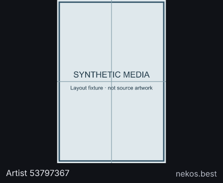
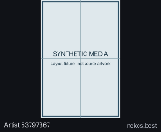

# Anime Images

Version 1.0.0. Quiet, whole-image framing for manually curated SFW illustrations
from Nekos.best. **Compact curated collection** is the default: six referenced
images were checked to fit Deskmate's 1 MB image limit on 2026-10-02 (about
202–994 KB). The initial image is time-seeded; each refresh or tap advances through
the collection, with coalesced taps respected. **New from Nekos.best** asks the
provider for candidates and tries the smallest, falling back to the compact
collection if it is unavailable or too large.

**Show whole image** preserves the original framing against a dark background.
**Fill** crops edges to fill the image area. The source credit remains below the
image. Default refresh is six hours; no credentials. Taps trigger a network render
and do not use instant staged views.

## Source and content terms

[Nekos.best](https://docs.nekos.best/getting-started/faq.html) describes its collection
as manually selected, fully safe for work, human-created images. That is the
provider's curation policy, not a guarantee that the plugin independently moderates
every future API result. Only the still-image `neko` category is used. The provider
may remove or replace content.

The [API](https://docs.nekos.best/getting-started/api-endpoints.html) is public and
requires no credentials. Requests include the required honest application
[User-Agent](https://docs.nekos.best/getting-started/api-reference.html):
`Deskmate (https://github.com/cosmicsymmetry/deskmate)`.
Only `nekos.best` is contacted; artist/source URLs are attribution, never fetched.

**Private noncommercial use only.** The
[provider's terms](https://docs.nekos.best/legal/tos.html) prohibit commercial use,
rehosting/reselling/monetizing content, bulk downloading, and public redistribution
of cached API responses. Image rights stay with the original artists. The plugin's
GPL-3.0-only code licence grants no image rights. No original source image is
committed. The server's per-account stored frame is for the owner's private display;
do not publish cached artwork or use this source in a commercial offering without
obtaining the required permissions separately.

The collection's original creator metadata stays in the plugin source, state and
logs. Latin, Greek and Cyrillic names render on the panel. The bundled font lacks
CJK, so those names use the creator's source account ID on the panel instead of
missing-glyph boxes; the original name and full source URL remain in state/logs.

## Bounded fetching and failures

Curated mode requests one image, with one alternate collection entry if it fails. Fresh mode requests eight small metadata entries,
then **one** image selected by pixel area, then at most one collection fallback.
It never bulk-downloads the candidate list. This is at most three requests/rounds
and roughly 2 MB of image responses under the host's 1 MB cap, below its 4 MB render
budget. Exact HTTPS image paths are checked before requesting. A previous fresh
URL is excluded from selection. Both PNG and JPEG signatures are accepted: some provider `.png` URLs return JPEG.
Image bytes are not persisted in plugin state.

If both images or the provider fail, the render throws a transient error and the
server retains its previous artwork. Changed/unsupported settings fail as
configuration errors. Images within the byte limit can still fail decoding; the
host retains the previous frame in that case. Collection entries require periodic
maintenance when removed by the provider.

## Verification and previews

```sh
bun run plugin:check anime-images
bun test test/plugins/media-cards.test.ts
bun run plugins/anime-images/preview.ts
```

Run from `companion/faces`. Recorded fixtures and committed full/40% previews are
labelled **synthetic media test patterns**, not anime artwork. They cover portrait
fit, fill, provider failure and unrecognized image hosts. The actual sandbox tests
also exercise oversized-response fallback, distinct taps and bounded state. Live
provider images were rendered and inspected only in temporary local files. No
physical-panel or hosted frame-store delivery is asserted.




## Image validation scope

Before accepting bytes, the plugin checks a complete, bounded image structure:
PNG chunk bounds/order, IHDR fields, all chunk CRCs, palette requirements, zlib
header and terminal IEND; JPEG segment bounds, frame dimensions, quantization and
Huffman table lengths, scan framing and terminal EOI. The same validator is bundled
into each standalone plugin because sandbox imports are unavailable. Invalid structure is transient and cannot advance saved selection;
Anime tries its bounded alternate image before failing.

These are **structural checks, not a complete pixel decoder**. They do not inflate
PNG IDAT streams or decode JPEG entropy data. A structurally consistent
but invalid compressed stream can still pass this check; the normal rasterizer is
responsible for decoding. No claim is made that every possible malformed image is
detected before rasterization. The tests pin common truncations (first 33 bytes,
first 100 bytes, and missing final chunks/terminators), PNG CRC damage, valid
synthetic PNG/JPEG rendering and Anime's truncation fallback.
