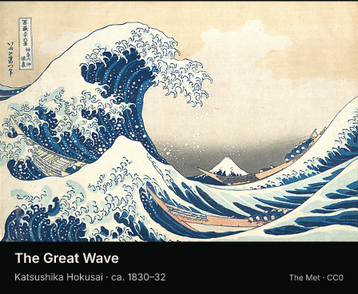

# Art of the Day

Version **1.0.0**, plugin id `art-of-the-day`. A small gallery of fourteen
public-domain works from The Metropolitan Museum of Art: five Japanese prints,
four landscapes and five other paintings. Tap to move to the next work.



## Settings and behavior

- **Collection:** All art (default), Japanese prints, Landscapes, or Paintings.
- **Change image:** Each day (default) or Shuffle each refresh. Daily selection uses
  the owner's local calendar date. Taps stay selected until the next local day;
  shuffle changes after each successful scheduled render, avoiding an immediate repeat.
- **Framing:** Show entire image (default) preserves the artwork on a black mat.
  Fill image area crops the image centrally. Neither choice stretches it.
- **Tap:** advances one work; coalesced taps advance the same number of places,
  wrapping around the chosen collection. A tap fetches and renders before the
  panel changes; it is not an instantaneous staged view.

The requested refresh is six hours. The server also checks successful cards for
date/timezone changes about once a minute. A frame stays fixed between successful
renders. Selection is deterministic for the supplied date, settings and state;
shuffle is pseudorandom, not a source of randomness for any other purpose. Changing
the collection or mode resets its selection. Unknown settings use the defaults.

## Reach and credentials

No account, credential, or secret is needed. Exactly two GET requests are planned:

1. `collectionapi.metmuseum.org`: the selected object's public JSON metadata.
2. `images.metmuseum.org`: its `primaryImageSmall` JPEG, only after confirming the
   object id, `isPublicDomain: true`, and an exact HTTPS host/path allowlist.

There is no search endpoint, redirect following, or user-supplied URL. The host
enforces its 1 MiB response limit; this plugin additionally requires a complete
JPEG envelope, sane dimensions and at most 380,000 image bytes so its embedded SVG
fits below 512 KiB. It uses two of three planning rounds, two of eight requests,
and under 200 bytes of state. No returned image URL appears as an external SVG resource.
Unavailable metadata, revoked public-domain status, rejected URLs, HTTP failures,
malformed/oversized images and timeouts fail through the existing transient error
path, retaining the previous frame and state. A first failed render has no image yet.

## Sources and licenses

Plugin code is original repository code under **GPL-3.0-only**. The Met's Open Access
image and metadata terms are separate: [Open Access](https://www.metmuseum.org/hubs/open-access)
and the [Collection API](https://metmuseum.github.io/) describe its **CC0** dataset
and public-domain images. Every bundled object was checked for `isPublicDomain: true`
on 2026-10-02, and that flag is checked again at render time. No third-party code is
copied into this plugin.

[catalog.json](catalog.json) records each object page, exact image URL, artist and
date; a few long titles are shortened for this small display. Some records have no
date; those captions omit it. [source-audit.json](source-audit.json) records the
live GET status, byte count and SHA-256 for every curated image, all served directly
without redirects. This is a curated fourteen-work rotation, not The Met's full
collection. Source availability can change.

`check.json` contains three public-domain Met images for offline reproduction:
[Hokusai, The Great Wave](https://www.metmuseum.org/art/collection/search/45434),
[Van Gogh, Wheat Field with Cypresses](https://www.metmuseum.org/art/collection/search/436535),
and [Van Gogh, Self-Portrait with a Straw Hat](https://www.metmuseum.org/art/collection/search/436532).
Their source records are in the catalog. The preview PNGs are actual plugin output
from these CC0 fixtures, including 40% desk-scale copies.

## Reproduce and validation

From `companion/faces/`:

```sh
bun test test/plugins/gallery-cards.test.ts
bun run plugin:check art-of-the-day
bun run check
bun run lint
bun run format:check
```

The checker runs real discovery, QuickJS, `renderRequest`, and the rasterizer with
network disabled. Its three cases cover a print, landscape crop and portrait fit.
The shared behavioral suite covers both galleries: real render-tap fallback,
coalesced taps, stable daily selection, local midnight and DST, shuffle, malformed
state, settings defaults, HTTP failures, rejected JPEGs and limits, exact source
allowlists, public-domain checks, every catalog item and measured caption widths.

An actual guarded-network render of the Great Wave also produced a 448×368 PNG on
2026-10-02. All full-size and desk-scale fixture previews were inspected. This
verifies local sandbox/network/raster behavior, not server storage, browser setup,
or delivery to a physical panel. Hosted deployment is a separate operator action.

Local validation: **29 shared behavioral tests passed**, both plugin checkers passed
(three art cases and two synthetic Ghibli cases), and faces typecheck, lint and
format checks passed. The Impeccable mechanical detector returned no findings.
All 32 downloaded source JPEGs also rendered through QuickJS and the real
rasterizer: maximum SVG sizes were 399,961 bytes for art and 449,862 bytes for
Ghibli, with no runtime notices.
