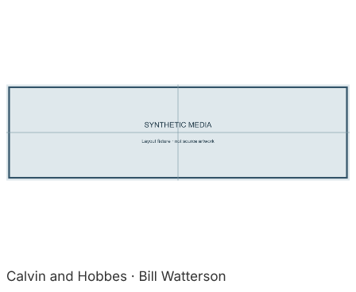
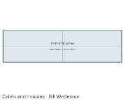

# Calvin and Hobbes

Version 1.0.0. Displays **operator-supplied, authorized official image URLs**. This
is not an automatic random archive or a daily GoComics integration. Automatic
public discovery could not be established: the GoComics Calvin page and help page
returned HTTP 403 on 2026-10-02; attempted public RSS routes were also inaccessible.
The public [TRMNL recipe](https://trmnl.com/recipes/27184) does not publish a supported
source endpoint. No login, paywall workaround, third-party archive or browser
impersonation is used.

## Configuration

Paste one to eight whitespace-separated HTTPS image URLs from
`featureassets.gocomics.com/assets/` (current CDN) or `assets.amuniversal.com`
(older CDN). These are direct image URLs
with their existing hexadecimal image IDs, not GoComics comic-page URLs. Use only
strips you are authorized to display. Other image hosts require an operator-reviewed
manifest/source change; arbitrary hosts cannot be added through card settings.
There are no credentials. Empty settings produce an actionable configuration error.

A refresh or tap advances through your supplied list; multiple coalesced taps
advance by that count. A single URL refreshes the same image. Changed lists reset a
selection that no longer exists. Default refresh is six hours; taps render over the
network, with no instant staging promise. The whole image fits inside the panel:
wide strips are letterboxed and may be small at desk distance. No panel rearranging
or cropping is performed.

## Sources and rights

[Calvin and Hobbes](https://www.gocomics.com/calvinandhobbes) is by Bill Watterson.
The plugin displays that credit. Strip rights remain with their respective owners;
a public CDN URL does not grant republication or commercial rights. The repository's
GPL-3.0-only licence covers this plugin code, **not the strips**. No strip artwork or
unlicensed mirror is bundled. The supplied-URL requirement is a real functionality
limitation, not a claim that an automatic feed is working.

## Failures and limits

Only those two exact CDN hosts are allowed; one image is requested per render. URLs must use the exact
HTTPS CDN hostname/path and a 20–64 character hexadecimal image ID (optional image
extension). PNG, JPEG and GIF are accepted; GIF displays its first frame.
Redirects, HTTP errors, missing or oversized images and unsupported formats fail
transiently and retain the previous frame. Only one selected URL is saved in state.
Malformed settings fail as configuration errors before any request.

## Verification and previews

```sh
bun run plugin:check calvin-and-hobbes
bun test test/plugins/media-cards.test.ts
bun run plugins/calvin-and-hobbes/preview.ts
```

Run from `companion/faces`. The committed full and 40% previews are plainly labelled
**synthetic test patterns**, not Calvin and Hobbes artwork. They prove supplied
image composition and list paging through the sandbox/rasterizer. Tests cover bad
hosts, empty settings, taps and failure retention. A publicly accessible official-CDN GIF was rendered successfully through the live
network/sandbox/raster pipeline and inspected at full/40% scale. It is not bundled
or configured by default. No physical-panel delivery is claimed.




## Image validation scope

Before accepting bytes, the plugin checks a complete, bounded image structure:
PNG chunk bounds/order, IHDR fields, all chunk CRCs, palette requirements, zlib
header and terminal IEND; JPEG segment bounds, frame dimensions, quantization and
Huffman table lengths, scan framing and terminal EOI; and (Calvin only) GIF colour
tables, image descriptors, terminated data sub-blocks and the final trailer. The
same validator is bundled into each standalone plugin because sandbox imports are
unavailable. Invalid structure is transient and cannot advance saved selection;
Anime tries its bounded alternate image before failing.

These are **structural checks, not a complete pixel decoder**. They do not inflate
PNG IDAT streams or decode JPEG entropy / GIF LZW data. A structurally consistent
but invalid compressed stream can still pass this check; the normal rasterizer is
responsible for decoding. No claim is made that every possible malformed image is
detected before rasterization. The tests pin common truncations (first 33 bytes,
first 100 bytes, and missing final chunks/terminators), PNG CRC damage, valid
synthetic PNG/JPEG/GIF rendering and Anime's truncation fallback.
