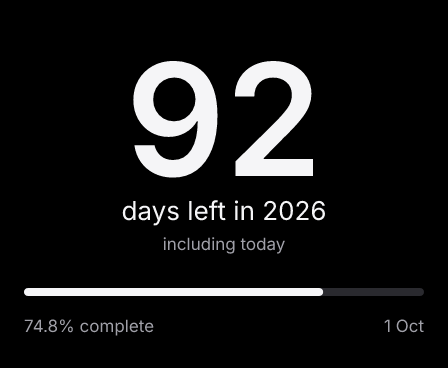

# Days Left This Year

A quiet calendar countdown for the 448×368 Deskmate panel: a large remaining-days
number, the current year, and a proportional year-progress bar. No settings, data
services, network requests, secrets, stored state, or tap behavior.

**Id:** `days-left-this-year` · **Version:** `1.0.0`

## What the count means

Today is included. January 1 shows **365** (or **366** in a leap year); December 31
shows **1**. At the next calendar date in a new year the count resets. The face says
“including today” and uses “day” for the final day.

Progress is **completed calendar days / days in that year**. It starts at 0.0% on
January 1 and reaches 99.7% on December 31, never 100% while that year is still in
progress. The label rounds to one decimal place; the bar uses the unrounded ratio.
Gregorian leap rules include the century exceptions: 2000 is leap, 2100 is not.
Calendar arithmetic avoids assuming every day lasts 24 hours.

## Timezone and freshness limitations

The plugin uses `context.now.local`, supplied by the host. **The current server does
not forward the owner's configured timezone.** Its render child therefore uses the
server process's timezone, falling back to UTC. Changing the panel's timezone setting
will not currently change this face's date. An explicit `timezone` in a direct faces
request is honored by the existing runtime; that is how the UTC fixtures below are
made. This plugin does not change the host's timezone contract.

The requested refresh cadence is **900 seconds (15 minutes)**, applied when a new
card is created. In normal operation the date can remain on the previous day until
the next scheduled render, up to roughly that interval plus rendering/delivery time.
There is no exact-midnight wakeup and no ticking on the device. An owner can change
the cadence, and existing cards keep their stored cadence across plugin updates.
When refresh or delivery fails, the existing stored frame remains and can be stale
for longer. Missing or invalid host dates fail the render rather than inventing a
count; the host's normal transient-error handling applies. No API can fail because
no API is called.

## Reproduce and inspect

From `companion/faces/`:

```sh
bun install --frozen-lockfile
bun run src/main.ts describe
printf '%s' '{"kind":"days-left-this-year","settings":{}}' \
  | bun run src/main.ts render > /tmp/days-left-this-year.json
bun run plugins/days-left-this-year/preview.ts
bun test
bun run check
bun run lint
bun run format:check
```

The CLI render returns a JSON envelope whose `png` field is base64. The preview
script discovers the shipped plugin and calls the actual `src/main.ts`
`renderRequest` entrypoint with fixed UTC instants. It writes three full-size PNGs
and their 40% reductions under `previews/`; the small images are scaled from those
same PNGs. `preview.ts` is author tooling, not sandboxed plugin code.

| Fixture (UTC) | 448×368 | 40% desk scale |
|---|---|---|
| 2026-10-01 12:00:00 | [October](previews/october.png) | [October](previews/october-desk.png) |
| 2026-12-31 23:59:59 | [Last day](previews/last-day.png) | [Last day](previews/last-day-desk.png) |
| 2028-01-01 00:00:00 | [Leap New Year](previews/leap-new-year.png) | [Leap New Year](previews/leap-new-year-desk.png) |



Tests in `test/plugins/days-left-this-year.test.ts` exercise the real QuickJS
sandbox: discovery's empty context, year rollover, leap boundaries and century
exceptions, both sides of local New Year, DST transitions, invalid dates, zero
network calls, and PNG dimensions through the real render entrypoint. The package's
catalog test also pins the new discovered entry.

The author inspected all three fixtures at full size and 40%: one-, two- and
three-digit counts fit; the count and its meaning remain readable at desk scale;
the quiet footer is secondary. This is local sandbox/PNG evidence, **not** a browser,
server frame-store, deployment, or physical-panel observation.

## Attribution

Original plugin code, licensed with this repository under GPL-3.0-only. Display
colors and spacing follow `src/kit/theme.ts`; typography uses the host's bundled
Inter Regular and SemiBold under the SIL Open Font License (see
`assets/fonts/OFL.txt`). No new third-party code or assets are bundled. The committed
previews are generated from this plugin by the included fixture script, not artwork
from an external service. Manifest author text is attribution, not a verified
publishing identity.
