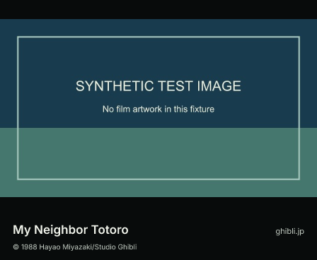

# Ghibli Scenes

Version **1.0.0**, plugin id `ghibli-scenes`. Eighteen stills from Studio Ghibli's
official galleries: three each from My Neighbor Totoro, Spirited Away, Howl's Moving
Castle, Kiki's Delivery Service, Ponyo and Castle in the Sky. Tap for the next scene.



## Settings and behavior

- **Film:** All six films (default), or one named film.
- **Change image:** Each day (default) uses the owner's local calendar date.
  Shuffle each refresh changes on each successful scheduled render without an
  immediate repeat. Both are deterministic for their inputs.
- **Framing:** Show entire image (default) preserves the still on a black mat.
  Fill image area crops centrally; neither choice stretches the source.
- **Tap:** advances one scene; coalesced taps advance by that count, wrapping
  around the selected film collection. Taps fetch and render before updating the
  panel; the hosted v1 runtime does not expose staged plugin views.

Daily taps remain selected until the next local day. Switching film or mode resets
selection. Unknown settings fall back to defaults. Refresh is requested every six
hours, with the host's additional local-date/timezone checks about once a minute
for successful cards. Frames do not change between successful renders.

## Reach and credentials

No credentials or secrets. One GET to **`www.ghibli.jp`**, using a fixed, verified
`/gallery/*.jpg` URL from [catalog.json](catalog.json). No URL field, remote catalog,
HTML scraping at runtime, redirect, or external SVG reference is used.

The host enforces its 1 MiB response cap. This plugin limits an image to 380,000
bytes, checks its JPEG envelope and dimensions, then embeds it in the SVG. It uses
one request/round and under 200 bytes of selection state; the resulting SVG stays
under 512 KiB. HTTP errors, timeouts and invalid/oversized images retain the previous
frame and state through the existing transient error path. A first failed render
has no image to show yet. Availability and the studio's terms can change.

## Copyright and source terms

**Film images remain copyrighted. They are not CC0, not GPL, and are not included
in this repository.** Plugin code is original repository code under GPL-3.0-only;
that license does not apply to images downloaded from Studio Ghibli.

The [official still-image announcement](https://www.ghibli.jp/info/013344/) and each
[work gallery](https://www.ghibli.jp/works/) invite use within the bounds of common
sense. This is the studio's stated usage condition, not a standardized open license
or a blanket grant of commercial redistribution rights. This plugin is unaffiliated
with Studio Ghibli. It retrieves directly from the studio for display and keeps each
film's exact copyright credit visibly on the face, with `ghibli.jp` as its source.
The complete gallery URL also remains in SVG metadata and the catalog.

The verified source galleries are [Totoro](https://www.ghibli.jp/works/totoro/),
[Spirited Away](https://www.ghibli.jp/works/chihiro/),
[Howl](https://www.ghibli.jp/works/howl/),
[Kiki](https://www.ghibli.jp/works/majo/),
[Ponyo](https://www.ghibli.jp/works/ponyo/), and
[Castle in the Sky](https://www.ghibli.jp/works/laputa/).
Every selected URL was extracted from those actual pages, then fetched directly
with HTTP 200 and no redirect on 2026-10-02. [source-audit.json](source-audit.json)
records the byte counts and SHA-256 hashes, with credits. URLs were not guessed.

## Fixtures, previews and validation

All image bytes in `check.json` and `previews/` are an original **synthetic test
image**, with that label baked into its pixels. They contain no Studio Ghibli
artwork. This fixture is contributed under CC0. Its simple colored rectangles and
label exercise the JPEG path, fitting, cropping and credits; they are not a visual
claim about the selected film. Captions/source metadata are real.

From `companion/faces/`:

```sh
bun test test/plugins/gallery-cards.test.ts
bun run plugin:check ghibli-scenes
bun run check
bun run lint
bun run format:check
```

The checker runs actual discovery, QuickJS, `renderRequest`, and rasterization with
network disabled, covering fit and crop with a long copyright credit. Full-size
448×368 PNGs and their 40% desk-scale versions were inspected. The shared behavioral
tests cover every catalog entry and caption width, real render-tap fallback,
coalesced taps, day changes and DST, shuffle, malformed state/settings, HTTP errors,
malformed/oversized JPEGs, request counts and runtime limits.

A separate live render through the normal guarded transport fetched an official
Totoro image and produced an inspected 448×368 PNG on 2026-10-02. That private live
preview is deliberately not committed. This establishes local source/sandbox/raster
behavior, not server persistence, browser setup or physical-panel delivery. Hosted
release remains a separate operator action.

Local validation: **29 shared behavioral tests passed**, both plugin checkers passed
(three art cases and two synthetic Ghibli cases), and faces typecheck, lint and
format checks passed. The Impeccable mechanical detector returned no findings.
All 32 downloaded source JPEGs also rendered through QuickJS and the real
rasterizer: maximum SVG sizes were 399,961 bytes for art and 449,862 bytes for
Ghibli, with no runtime notices.
