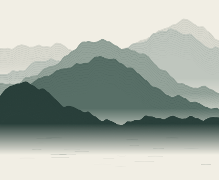
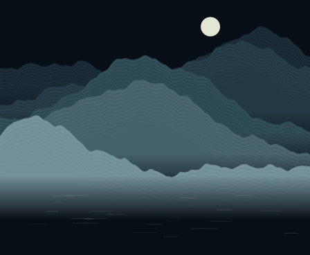

# Ink Landscape

Original procedural mountain ridges, mist and quiet water, drawn entirely offline.
The compositions are inspired by the spatial layering of ink landscapes; they are
not copies of Shan Shui or its source code. The small moon in the night palette is
compositional, not a moon-phase reading.




## Settings and interaction

- **Palette:** Ink on paper (default) or Moonlit ink.
- **New landscape:** Each day (default) or Each hour, using the owner's timezone.
- **Tap:** advance to another landscape in the current period. Coalesced taps
  advance by the corresponding number. The chosen landscape remains stable until
  the next period or tap. Palette changes retain the same underlying terrain.

The plugin requests a 15-minute refresh. A new hour can therefore appear up to
roughly 15 minutes later; the server checks local date changes separately. A tap
uses the existing server render path, so the picture does not change instantly on
the device. Restarting without saved plugin state returns to that period's first
landscape. There are 65,536 selections per period before the tap counter wraps.

## Permissions, attribution and limits

Version 1.0.0 needs no network hosts, credentials, files, or external assets.
Both the implementation and generated artwork are original Deskmate contributions
under this repository's GPL-3.0-only license. The artwork uses deterministic seeded
height fields and contour lines; no model or external image service runs at refresh.

The only persistent state is a version, the local date/hour key and a small counter.
Invalid state is discarded. Failure to read the host's clock fails the render and
keeps the previous frame instead of inventing a date.

## Verification

From `companion/faces`:

```sh
bun test test/plugins/ink-landscape.test.ts
bun run plugin:check ink-landscape
```

The five fixtures render through discovery, QuickJS and the production rasterizer.
`previews/` contains the corresponding full-size and 40% desk-size outputs, copied
from `out/plugins/ink-landscape/`. They are original generated artwork, not external
images. Tests verify local-date/hour boundaries, determinism, coalesced taps, state
repair, palette selection, bounded output and actual 448×368 raster output. These
checks establish server drawing, not physical-panel delivery.
