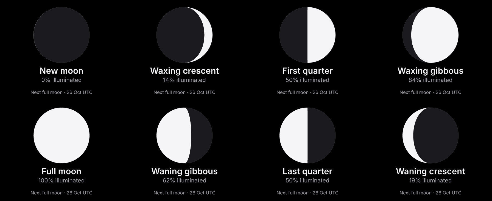

# Moon Phase

An offline Moon Phase card for Deskmate: a large geometric moon, its phase name,
the illuminated percentage, and the next full moon's **UTC date**. No credentials,
location, external service or network permissions are needed.



## Settings

**Hemisphere:** Northern (default) or Southern. Southern flips the illuminated side;
it does not change the phase, illumination or full moon date. Unknown or missing
settings fall back to Northern. The existing settings form saves this choice.

The disc is a schematic view, not a photograph or a prediction of its rotation in
your sky. It does not model local horizon tilt, libration, moonrise/set, terrain,
atmospheric visibility or eclipse shadows.

## Calculations and date conventions

Version 1.0.0 implements the solar/lunar orbital formulae and lunar perturbations
described by [Paul Schlyter](https://stjarnhimlen.se/comp/ppcomp.html), with a bounded
search for the next Sun–Moon longitude opposition. The implementation is original
repository code under GPL-3.0-only; no external code or image assets are bundled.
The moon geometry is drawn directly from the calculated illuminated fraction.

- All calculations use the host-injected `now.utc`. Full moon dates are explicitly
  labeled UTC on the face and can differ from your local calendar date. The server
  supplies an owner timezone, but this plugin deliberately uses UTC for both its
  calculation and event date so its convention is explicit and consistent.
- Dates from 1900 through 2099 are supported. An invalid/out-of-range host clock
  fails the render through the existing error path instead of inventing a value.
- The illuminated fraction includes lunar latitude and the finite Sun–Moon distance,
  and is rounded to a whole percentage. The four primary phase names apply within
  6 degrees of their events; the intermediate names distinguish waxing and waning.
- The full moon date refers to the next calculated event strictly after the render
  instant. Once that event passes, the footer moves to the following lunation even
  while the current phase still reads “Full moon.” The year is shown across a year
  boundary.
- This is an approximate astronomical model. Tests compare all 39 full moons in
  2026, 2028 and 2099 with [NASA/GSFC's reference table](https://eclipse.gsfc.nasa.gov/phase/phases2001.html),
  requiring agreement within 15 minutes and the same UTC date. October 2026 primary
  phases and illumination are also checked against
  [USNO](https://aa.usno.navy.mil/calculated/moon/phases?date=2026-10-01&format=p&nump=6).
  These checks are not a guarantee across the entire supported range: an event very
  close to midnight may fall on the adjacent date in a more precise ephemeris.

The requested refresh is **900 seconds** (15 minutes), subject to the server's
scheduler. The frame stays fixed between refreshes. There is no tap behavior or
persistent state, and no promise of an exact event-time update.

## Reproduce

From `companion/faces/`:

```sh
bun test test/plugins/moon-phase.test.ts
bun run plugin:check moon-phase
bun plugins/moon-phase/preview.ts
bun run src/main.ts describe
echo '{"kind":"moon-phase","settings":{"hemisphere":"north"}}' \
  | bun run src/main.ts render > /tmp/moon-phase.json
```

The last command returns a JSON envelope; decode its base64 `png` field to view it.
`check.json` supplies fixed October 2026 phase cases, a Southern crescent and a year
rollover for the offline author checker and CI preview artifact. `preview.ts` renders
the same cases through discovery, QuickJS and the actual entrypoint, writing full-size
448×368 images, 40% desk-scale versions, and the eight-phase sheet above.

Verification covers the sandbox, catalog and raster output. It does not establish
delivery to or appearance on a physical panel. Submission and hosted deployment
remain separate steps.
