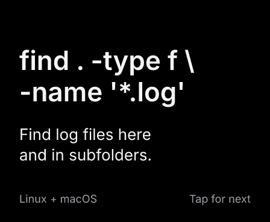

# Terminal Command

An offline Deskboy card with 30 familiar terminal commands: one useful command,
a plain-English explanation and its supported platforms. Nothing is executed.
No account, network, secret or additional font is needed.



[All 30 commands at desk size](previews/all-commands.desk.png) ·
[Linux date](previews/linux-date.png) · [macOS date](previews/macos-date.png) ·
[Files at 40%](previews/files.desk.png) · [Long command at 40%](previews/find.desk.png)

## Settings and interaction

**Commands for:** Both Linux and macOS (default), Linux, or macOS. Both mixes all
30 entries, including system-specific ones; the footer always identifies the
selected command's actual support. Linux and macOS each include the 24 shared
commands plus their three specific examples. Unknown settings fall back to Both.

Selection is deterministic pseudorandom, using only the injected owner-local date,
setting and validated tap offset. A seeded Fisher–Yates shuffle makes a deck for
each calendar block of 30 days (27 for a single-platform setting). Each local day
advances one place. Within a block every command appears once before repetition;
across block boundaries a repeat is possible. This is a curated rotation, not a
popularity ranking or cryptographic randomness. Identical cards share a daily pick.

Tap to advance one place; coalesced taps advance by their count, wrapping at the
end. The existing host bounds each event to 1–32 taps. The selected command stays
through scheduled refreshes that day. A changed local date, timezone or platform
resets the tap offset. State stores only date, zone, setting and offset; malformed
state resets safely and cannot supply command text. No `Math.random`, wall-clock
lookup, imports or networking runs in the sandbox.

The requested refresh is six hours (21,600 seconds). The host additionally checks
successful faces for local date/zone changes roughly once a minute; delivery takes
longer. There is no ticking on the panel or exact-midnight promise. Taps take the
plugin v1 render path, with no staged or instant-response claim. Clock/measurement
failures use the existing transient-error path, retaining the last frame/state.

## Command compatibility audit

Checked 2026-10-04 against the installed macOS 26.6.2 manuals for **every** shared
and macOS command, and the upstream Linux references linked below. All 27 macOS
invocations were also run with stock `/bin`/`/usr/bin` tools against disposable
sample files where applicable. `tail -f` produced the sample and kept following;
the audit then terminated it. `less` and `man` were checked without an interactive
pager; their quit key was checked in the manuals. Linux verification here is
against upstream documentation, not a claim of execution on a Linux machine.

These examples target a normal GNU/Linux userland and stock macOS with a
Bourne-compatible shell (including bash and zsh). Minimal Linux installs may need
coreutils, findutils, grep, sed, tar, diffutils, procps-ng, util-linux, file, less
or man-db installed. BusyBox and replacement utilities are not claimed compatible.
Example files (`file.txt`, `app.log`, `archive.tar`, `old.txt`, `new.txt`) must exist;
replace them with your own paths. Quote paths containing spaces. A displayed `\`
continues the same command on the next line; it is never an omitted argument.

| Command | Platforms | Verified behavior / upstream reference |
| --- | --- | --- |
| `pwd` | Both | Current directory; [coreutils][core] and `man pwd`. |
| `ls -lah` | Both | `-a` includes hidden entries, `-l` details, `-h` readable sizes; [coreutils][core], `man ls`. |
| `du -sh .` | Both | Summarized disk usage with size suffixes; [coreutils][core], `man du`. |
| `df -h .` | Both | Filesystem containing `.` with readable sizes; [coreutils][core], `man df`. |
| `find . -type f -name '*.log'` | Both | Regular files, quoted name glob, implicit print; [findutils][find], `man find`. |
| `grep -n 'TODO' file.txt` | Both | Matching lines with line numbers; [grep][grep], `man grep`. |
| `head -n 20 file.txt` | Both | First 20 lines; [coreutils][core], `man head`. |
| `tail -n 20 file.txt` | Both | Last 20 lines; [coreutils][core], `man tail`. |
| `tail -f app.log` | Both | Follow appended data; [coreutils][core], `man tail`. Does not promise rotation tracking. |
| `wc -l file.txt` | Both | Newline count; [coreutils][core], `man wc`. An unterminated final line is not counted. |
| `sort -u file.txt` | Both | Sorted unique output; [coreutils][core], `man sort`. Locale affects ordering/equality. |
| `less file.txt` | Both | File pager, `q` quits; [less][less], `man less`. |
| `file file.txt` | Both | Classifies file content/type; [file][file], `man file`. |
| `command -v git` | Both | Shell resolution, not a guarantee git is installed; [bash][bash], local bash/zsh builtins. |
| `uname -srm` | Both | Kernel, release, machine; [coreutils][core], `man uname`. macOS reports Darwin. |
| `id` | Both | User/group identifiers; [coreutils][core], `man id`. |
| `uptime` | Both | Uptime and load averages; [procps-ng][uptime], `man uptime`. |
| `ps -ef` | Both | All processes, full format with command arguments; [procps-ng][ps], `man ps`. Output can truncate. |
| `date '+%Y-%m-%d'` | Both | Formatted local date; [coreutils][core], `man date`/`strftime`. |
| `sed -n '1,20p' file.txt` | Both | Inclusive range printed, no in-place edit; [sed][sed], `man sed`. |
| `tar -tf archive.tar` | Both | List specified archive; [GNU tar][tar], macOS `man tar` (bsdtar). |
| `diff -u old.txt new.txt` | Both | Unified context; [diffutils][diff], `man diff`. Exit 1 means differences. |
| `man ls` | Both | Manual lookup; [man-db][man], `man man`. `q` assumes the usual less/more pager. |
| `printenv PATH` | Both | Print just PATH; [coreutils][core], `man printenv`. |
| `free -h` | Linux | Readable memory/swap sizes; [procps-ng][free]. |
| `lsblk -f` | Linux | Block devices with filesystem fields; [util-linux][lsblk]. |
| `date -d tomorrow '+%F'` | Linux | GNU relative date input, ISO date output; [coreutils][core]. |
| `sw_vers` | macOS | OS version/build; installed `man sw_vers`. |
| `pmset -g batt` | macOS | Read-only power/battery status; installed `man pmset`, including its exact example. |
| `date -v+1d '+%F'` | macOS | BSD day adjustment only changes displayed result; installed `man date`/`strftime`. |

`date -d` and `date -v` are deliberately separate entries. No `sed -i`, `stat`
formatting, `xargs` portability assumptions, destructive actions, privilege changes,
remote shell pipelines or downloads are included. Commands show information only;
the plugin never connects to your computer or reads its files.

[core]: https://github.com/coreutils/coreutils/blob/master/doc/coreutils.texi
[find]: https://www.gnu.org/software/findutils/manual/html_mono/find.html
[grep]: https://www.gnu.org/software/grep/manual/grep.html
[sed]: https://www.gnu.org/software/sed/manual/sed.html
[tar]: https://www.gnu.org/software/tar/manual/tar.html
[diff]: https://www.gnu.org/software/diffutils/manual/diffutils.html
[bash]: https://www.gnu.org/software/bash/manual/html_node/Bash-Builtins.html
[less]: https://greenwoodsoftware.com/less/faq.html
[file]: https://github.com/file/file/blob/master/doc/file.man
[uptime]: https://gitlab.com/procps-ng/procps/-/blob/master/man/uptime.1
[ps]: https://gitlab.com/procps-ng/procps/-/blob/master/man/ps.1
[free]: https://gitlab.com/procps-ng/procps/-/blob/master/man/free.1
[lsblk]: https://github.com/util-linux/util-linux/blob/master/lsblk-cmd/lsblk.8.adoc
[man]: https://gitlab.com/cjwatson/man-db/-/blob/main/man/man1/man.man1

## Layout, reproduction and limits

The command uses 32–44 px Inter Semibold; its explanation uses 26 px Inter Regular,
wrapping to two lines. The 18 px platform/tap footer stays secondary. Commands and
explanations are measured by the actual host renderer, including quotes and
continuation marks; tests check the static footer's ink bounds too.
There is no letter-spacing or fractional SVG coordinate formatting. The bundled
list fits 32 px margins without clipping or ellipses. A render uses one local
measurement round (under 64 measurements), no HTTP requests and under 200 bytes of
normal state.

From `companion/faces/`:

```sh
bun test plugins/terminal-command/index.test.js
bun run plugin:check terminal-command
bun plugins/terminal-command/preview.js
```

`check.json` covers every command plus each platform setting, Tokyo New Year and
leap day: 34 full/desk pairs under `out/plugins/terminal-command/`. `preview.js`
uses the same checker, copies six representative pairs to `previews/` and composes
the 30-command desk sheet from those real PNGs; it draws no alternative face.
Tests verify complete tap cycles in every filter, deterministic daily decks,
coalescing, refresh stability, reset boundaries, invalid inputs, actual text ink
bounds, PNG dimensions and the server entrypoint against every preview fixture.

Code, explanations and preview compositions are original GPL-3.0-only repository
work. Command manuals are linked as factual references, not bundled. Font rendering
uses the existing bundled Inter (OFL). No third-party artwork or telemetry is added.

Verification covers sandbox/entrypoint rendering and local PNG inspection. It does
not establish delivery to or appearance on a physical panel. Owner visual acceptance,
merge and hosted deployment remain separate steps.
