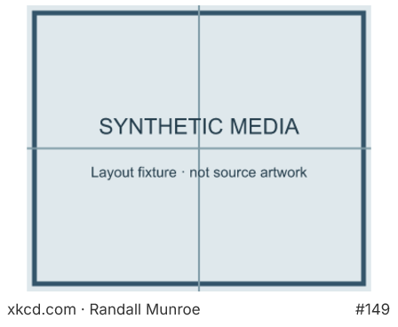
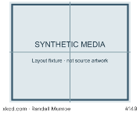

# xkcd

Version 1.0.0. A comic fills the panel above a small Randall Munroe credit and comic
number. **Compact selection** rotates six inspected single-panel comics, starting
at a time-seeded random position; refresh advances one and a tap advances by its tap
count. **Latest comic** fetches the current official comic on refresh or tap. It
always shows the whole image; unusually wide or tall latest comics can be too small
to read comfortably on this panel.

No credentials. Default refresh: six hours. Tap handling uses the server's rendered
fallback, so a tap downloads metadata and artwork; this is not instant staged paging.

## Sources and permissions

The [official JSON interface](https://xkcd.com/about/) uses
`https://xkcd.com/info.0.json` and `https://xkcd.com/<number>/info.0.json`.
Images come only from `imgs.xkcd.com/comics/`; the plugin validates this exact host
and HTTPS path before requesting bytes. It requests two responses per render.

Compact collection: 149 Sandwich; 303 Compiling; 88 Escher Bracelet; 55 Useless;
231 Cat Proximity; 259 Clichéd Exchanges. The original
artwork is never cropped, redrawn, translated or bundled in this repository.

Plugin code follows the repository GPL-3.0-only licence. The comic content does
**not**: Randall Munroe's [content licence](https://xkcd.com/license.html) is
[CC BY-NC 2.5](https://creativecommons.org/licenses/by-nc/2.5/). His licence page
also describes additional permissions for occasional attributed reprints.
This plugin does not claim general commercial content rights. No affiliation with
xkcd is implied. Sources and live URLs checked 2026-10-02.

## Failure behavior

HTTP failures (including redirects), missing metadata, unsupported image hosts,
invalid images and oversized responses throw a transient error so the server keeps
its previous frame and retries. An unsupported mode is a configuration error.
Only the last comic number, mode and collection position are saved; no image bytes
are stored in plugin state. The host's usual per-response and memory caps apply.

## Verification and previews

Run from `companion/faces`:

```sh
bun run plugin:check xkcd
bun test test/plugins/media-cards.test.ts
bun run plugins/xkcd/preview.ts
```

`check.json` and committed previews use a labelled **synthetic media test pattern**,
not xkcd artwork. Full and 40% previews exercise compact, wide/latest and multi-tap
states through the actual sandbox and rasterizer. Failure, host and setting paths
are covered by focused tests. Actual source renders were also inspected locally;
those copyright-bearing temporary images are not committed. No physical panel or
hosted frame-store delivery is asserted.




## Image validation scope

Before accepting bytes, the plugin checks a complete, bounded image structure:
PNG chunk bounds/order, IHDR fields, all chunk CRCs, palette requirements, zlib
header and terminal IEND; JPEG segment bounds, frame dimensions, quantization and
Huffman table lengths, scan framing and terminal EOI; and (Calvin only) GIF colour
tables, image descriptors, terminated data sub-blocks and the final trailer. The
same validator is bundled into each standalone plugin because sandbox imports are
unavailable. Invalid structure is transient and cannot advance saved selection;
Anime tries its bounded alternate image before failing.

These are **structural checks, not a complete pixel decoder**. They do not inflate
PNG IDAT streams or decode JPEG entropy / GIF LZW data. A structurally consistent
but invalid compressed stream can still pass this check; the normal rasterizer is
responsible for decoding. No claim is made that every possible malformed image is
detected before rasterization. The tests pin common truncations (first 33 bytes,
first 100 bytes, and missing final chunks/terminators), PNG CRC damage, valid
synthetic PNG/JPEG/GIF rendering and Anime's truncation fallback.
