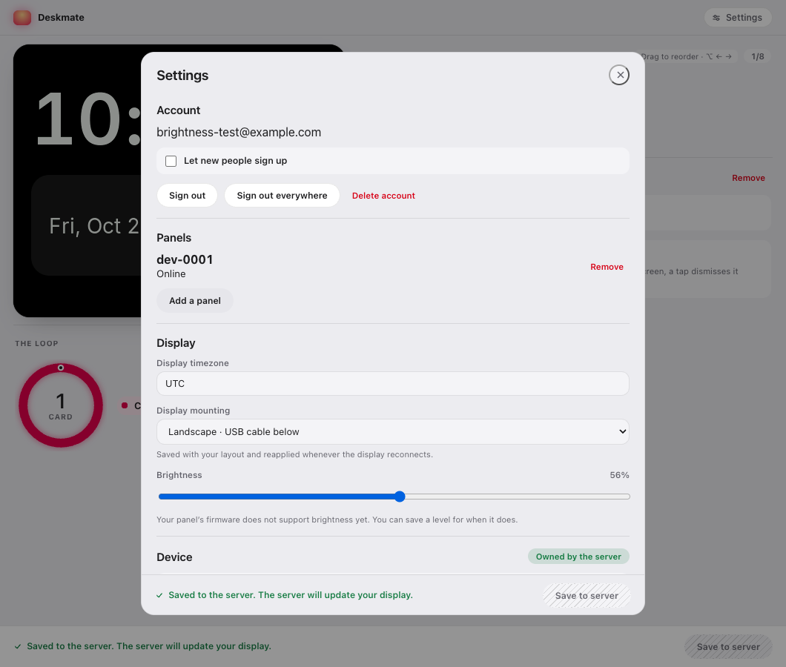
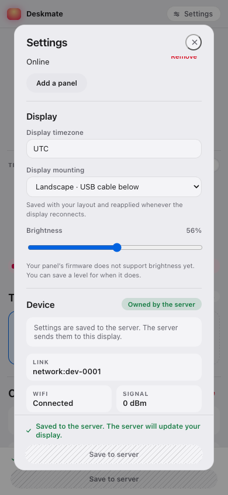

# Track H: panel brightness

Date: 2026-10-02. Owner-authorized implementation on `track-h/brightness`.
The owner's handoff explicitly authorizes the schema, wire and firmware boundaries.
The dead `feat/display-brightness` commits were neither rebased nor cherry-picked.

## Decisions

- Schema **v11**, `preferences.brightness`, integer **10..100 percent**. Omission
  means **78**. Quantize to the panel's 256 levels with
  `min(255, ceil(percent * 256 / 100))`: 10→26, 50→128, 78→200, 100→255.
  This upward quantization preserves the existing **200/255** final boot level
  exactly (`main.c` overrides `display.c`'s initial 255), including after migration.
  The percentage is a control scale, not measured luminance. The floor prevents a
  software blackout without claiming that 10% has been seen from a desk.
- Strict v10→v11 migration retains every existing field and adds that default, in
  memory only. Its load origin is `migrated`; only an explicit save writes v11.
  The v10 preferences shape remains closed, so even `brightness` is rejected in a
  document claiming v10. v10 and v11 are readable; all other versions retain the
  typed refusal/fallback/non-overwrite behavior. Both frozen config documents stay.
- Additive protocol-v2 **ApplyConfig key 4**, optional raw level **26..255**, gated
  by new capability bit **11, DisplayBrightness**. Current capabilities: **4064**.
  Bits 0–4 and key 2 remain retired. Both initial sends and reconnect replay check
  the running firmware's bit. Brightness is not a required capability for saving.
  The cache retains desired brightness; only the transmitted copy is gated. An
  upgrade, including after a downgrade, restores the saved level without another
  save. A changed payload advances a matching revision before being sent.
  Omission retains the current level. `StatusResponse` key 6 reports the actual
  last successful board write. Incorrect types and levels are rejected before use.
- Firmware **v2.3.0-brightness** (not previously used in repository version history).
  ApplyConfig queues a scalar command, coalesced by kind; the LVGL timer consumer
  calls the existing QSPI-correct `board_display_set_brightness()`. No board write
  occurs in the protocol callback, no NVS persistence, no new statics. ACK confirms
  accepted work; a driver failure is logged and status retains the last applied
  level. A reboot starts at 200 and linking restores the owner's saved value.
  Same-revision configs compare their semantic contents before accepting replay,
  so a changed brightness cannot bypass revision checks. The standalone clock's
  top-half brightness diagnostic is untouched.
- One native slider in the existing SettingsSheet, using the existing draft and
  Save action. The visible label targets the slider, the readout shows percent,
  keyboard arrows step by one, and validation is attached to the field. Connected
  unsupported firmware gets a plain explanation while the setting stays saveable.
  Preview pixels remain upright and undimmed at both mountings and both extremes.
- **No flash-first deploy order.** Existing `v2.2.0-psram` receives no key 4 and
  continues working. Its decoder accepts and skips unknown key 4; the bit-11 gate
  is protocol hygiene, not what prevents decoder rejection. The schema bump still
  requires the v11 server before its SPA.
  Firmware installation is a separate owner operation. No deployment occurred.

Auto-brightness, schedules, night mode, per-card levels and gestures are out of scope.

## Verification record

All required local gates passed: firmware clean host tests, ASan/UBSan, IDF build;
Rust formatting, clippy with `-D warnings`, **868 workspace tests** and the separate
doctest invocation; **218 window tests**, TypeScript check, format check and production
build; **556 faces tests**, type check, lint and format check. Migration checks cover
all authored fields and invalid migrated card lists.
Rust uses the repository's pinned 1.98.0 toolchain from `companion/`. An earlier root-directory invocation used
1.97 and produced unrelated unknown-lint errors; no lint policy was weakened.

The first CI run exposed an existing race in
`a_tap_naming_a_card_that_does_not_exist_is_counted_and_dropped`: the atomic counter
advances before the worker publishes its snapshot. The test now waits for the
snapshot it asserts, retaining the sink and accessor checks. Forcing the snapshot's
tap counter to zero still fails that test on its bounded wait; the mutation was
restored before rerunning the Rust gates. Runtime behavior is unchanged by this fix.
The local rerun also exposed a race in `hostile_device_frames_are_bounded_and_concatenated_frames_decode`:
an already queued scheduled request could arrive before the close frame. Its helper
now waits through those messages for closure within the original one-second deadline
(less than the two-second request timeout). Disabling wire-decode rejection still
fails that closure assertion. These are test synchronization fixes only.

Firmware size measured with `idf.py size` against the clean `origin/main` image at
`c20dbbb`, using the same local configuration/toolchain:

| Section | Baseline bytes | Brightness bytes | Delta |
| --- | ---: | ---: | ---: |
| `.bss` | 87,000 | 87,000 | 0 |
| `.data` | 23,128 | 23,128 | 0 |
| IRAM | 16,384 | 16,384 | 0 |
| DIRAM | 203,763 | 203,763 | 0 |
| Total image (size report) | 1,594,079 | 1,594,627 | +548 |

The optional brightness bytes fit existing ApplyConfig padding; the UI command byte
also uses existing padding. Zero statics delta does not prove OTA or hardware behavior.

### Browser and preview

The production `dist/` was served by the real Rust server via `DESKMATE_WEB_DIR`,
using a throwaway localhost instance and a synthetic account, and driven in Google
Chrome with agent-browser. No serial API was invoked. Observed:

- Offline: 78→55, existing sheet Save, reload still 55; the actual saved file is v11.
- Local WebSocket simulator advertising **2016**: unsupported-firmware explanation
  is visible, 55→56 still saves, and the captured ApplyConfig has **no key 4**.
- Clicking the visible label focuses the slider; ArrowRight changes by one.
- The same simulator advertising **4064**: explanation clears, 56→57 saves and
  reloads, and captured ApplyConfig carries raw **146**. This is a local simulated
  link, not a physical panel result.
- Desktop 1060×900 and mobile 390×844: control and copy readable, no horizontal
  overflow; browser error list empty. Impeccable detector returned `[]`; finish
  review scored the label fix resolved and the recaptured layout unchanged.
- The real LVGL preview integration test compares PNGs for the Cartesian product
  of both mountings and brightness 10/100; all four must be byte-identical.

### Mutation evidence

Each mutation was applied alone, its named assertion failed (not compilation), and
production source was restored. Positive full gates were rerun after restoration.

| Deliberately removed or changed protection | Failing test |
| --- | --- |
| Firmware wire floor | C `test_config_brightness` |
| Firmware unsigned-byte upper bound (282 wrapping to legal 26) | C `test_config_brightness` |
| Model brightness floor | C `test_brightness_rejection_and_replay` |
| Replay brightness value / presence / rotation / tap / card count / card ID comparison (six separate probes) | C `test_brightness_rejection_and_replay` |
| Brightness command coalescing | C `test_brightness_coalesces_and_survives_host_loss` |
| Brightness action dispatch to the UI consumer | C `test_brightness_coalesces_and_survives_host_loss` |
| Server initial bit-11 gate | `brightness_is_gated_on_initial_apply_and_firmware_downgrade_replay` |
| Server reconnect bit-11 gate | `brightness_is_gated_on_initial_apply_and_firmware_downgrade_replay` |
| Config 10% floor / 100% ceiling (two probes) | `brightness_defaults_bounds_and_quantization` |
| Quantization saturation at raw 255 | `brightness_defaults_bounds_and_quantization` |
| Default 78 changed to 77 | `v10_migration_preserves_boot_brightness_and_original_bytes` |
| v10 accepted-version gate | `v10_migration_preserves_boot_brightness_and_original_bytes` |
| Closed v10 preference shape | `v10_migration_keeps_closed_preferences_and_validation` |
| Rust wire brightness floor | `brightness_fixtures_pin_presence_floor_and_narrowing` |

**20 mutations killed.** Valid fixtures cover omitted, minimum, default and maximum
brightness, with byte-for-byte Rust/C round trips; hostile fixtures cover zero, below
floor, overflow, negative and boolean values. The Web Serial codec's existing exact
fixture tests also pass with the amended capability word.

### Review round 1: brightness across firmware changes

The review found that gating before caching discarded the desired level, both when
saving on unsupported firmware and during downgrade replay. The server now retains
the desired config and gates a transmitted copy. It tracks the last acknowledged
brightness payload so a support change also replays when revisions match, advancing
the revision for changed content. Unsupported firmware still receives no key 4.

`saved_brightness_survives_firmware_upgrade_downgrade_and_upgrade` failed on the
reviewed code (`None` instead of raw `26`) and passes after the fix. It exercises
2016→4064→2016→4064 with reset, matching, and newer device revisions, and verifies
that unchanged reconnects do not resend. `brightness_upgrade_refuses_an_exhausted_revision_before_sending`
checks the matching-revision boundary at `u32::MAX` without sending an invalid apply.

Seven review-round mutation probes failed, with sources restored afterward:

| Mutation | Failing test |
| --- | --- |
| Cache the gated initial payload | `saved_brightness_survives_firmware_upgrade_downgrade_and_upgrade` |
| Overwrite desired brightness during gated replay | same regression |
| Skip replay when only capability support changes | same regression |
| Reuse the matching revision for changed content | same regression |
| Do not remember the acknowledged replay brightness | same regression |
| Remove initial bit-11 gate | same regression and `brightness_is_gated_on_initial_apply_and_firmware_downgrade_replay` |
| Remove replay bit-11 gate | both brightness tests above |

The independent review compiled the older decoder against the new fixture and
observed it accepting and skipping key 4. Documentation therefore describes the gate
as enforcement of advertised feature support. The existing Settings Save action was
confirmed by the owner; there is no drag-to-autosave change in this round.

After restoring the probes, Rust 1.98.0 formatting, workspace/all-target clippy with
`-D warnings`, all **870 workspace tests**, and separate doctests passed. This round
changes server replay and its tests/documentation; the firmware and window are unchanged.

## Hardware still owed — UNOBSERVED

Owner's USB flash, OTA download re-verification, visible brightness at 10/78/100%
in both 90° and 270° mountings, status key 6 agreement after apply, reboot/default/
relink restoration, and preservation of the standalone diagnostic. The 10% floor's
comfort/visibility is not a calibrated or observed claim. No serial port was opened;
no flash, OTA, firmware publication, deployment or merge was performed by this track.
